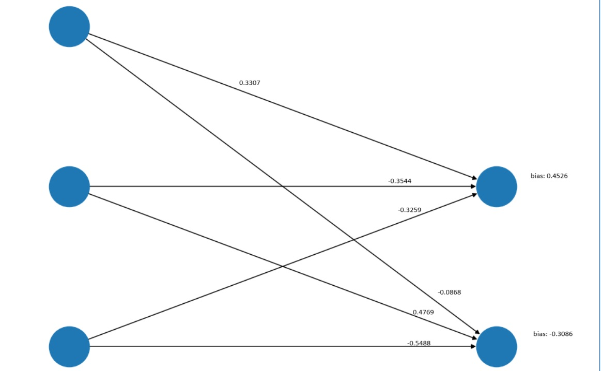

# How ai network works
In this project we will create a simple network that can detect numbers from handwritten images.

If you are not familiar with basics of neural networks here is a good video explaining them: https://www.youtube.com/watch?v=CqOfi41LfDw

Below the detailed code explanation

# What is nn.Linear?

The `nn.Linear` function in PyTorch represents a fully connected layer, also known as a dense layer. It performs a linear transformation on the input data by multiplying it with a weight matrix and adding a bias vector.

## Example: nn.Linear(3,2) 

Let's visualize how a `nn.Linear(2, 3)` layer looks like:

**Weights:**
Parameter containing:

<code>tensor([[ 0.3307, -0.3544, -0.3259],
        [-0.0868,  0.4769, -0.5488]], requires_grad=True)
</code>

**Bias:**
Parameter containing:
<code>
tensor([ 0.4526, -0.3086], requires_grad=True)
</code>

**Explanation:**

- **Weights:** The `weight` tensor is a 3x2 matrix. Each row represents the weights connecting the input features to one of the output features. 
- **Bias:** The `bias` tensor is a 1D vector of size 3. Each element represents a bias value that is added to each of the output features.

**Key Points:**

- These are just example random values. The actual values will be different each time you run the code.
- These weights and biases will be updated during the training process of the neural network to learn the desired mapping between inputs and outputs.

If we visualize it:

# Understanding forward function
When you call `net(inputs)`, PyTorch internally does:

`outputs = net.__call__(inputs)`

The __call__ method of nn.Module is implemented as follows:
<pre>
def __call__(self, *input, **kwargs):
    for hook in self._forward_pre_hooks.values():
        hook(self, input)
    result = self.forward(*input, **kwargs)
    for hook in self._forward_hooks.values():
        hook(self, input, result)
    if torch._C._get_tracing_state():
        self._traced_module(*input, **kwargs)
    return result
</pre>

Here's the forward method again for reference:
<pre>
def forward(self, x):
    x = x.view(-1, 28 * 28)             # Flatten the input
    x = torch.relu(self.fc1(x))         # Apply ReLU activation to layer 1
    x = torch.relu(self.fc2(x))         # Apply ReLU activation to layer 2
    x = self.fc3(x)                     # Output layer (no activation)
    return x

</pre>
## Why Flatten the Input?
The MNIST dataset consists of images of handwritten digits, each of size 28x28 pixels. Convolutional neural networks (CNNs) can operate directly on these 2D images using convolutional layers. However, here we're using fully connected (dense) layers, which expect 1D input vectors rather than 2D matrices.

Fully connected layers (also known as dense layers) require the input to be a flat vector because each neuron in the layer is connected to every neuron in the previous layer. Here's how it works:

Input Shape: Each MNIST image is of shape (1, 28, 28) for a single channel (grayscale). Tutorial about tensor shapes(https://www.youtube.com/watch?v=QheqfvqCFS4&t=1900s)
Flattening: To convert the 2D image into a 1D vector, you need to reshape it from **(1, 28, 28)** to (1, 28 * 28), which is **(1, 784)**.

## Data Processing

**Transformation function:**
<pre>
transform = transforms.Compose([
    transforms.ToTensor(),
    transforms.Normalize((0.5,), (0.5,))
])
</pre>
`transforms.ToTensor()`:

- Converts a PIL Image or NumPy array to a tensor.
- The pixel values are scaled from the range [0, 255] to [0, 1].

`transforms.Normalize((0.5,), (0.5,))`:

- Normalizes the tensor with mean 0.5 and standard deviation 0.5.

**Loading data**

We load data as follows:

`trainset = torchvision.datasets.MNIST(root='./data', train=False, download=True, transform=transform)
`

Dataset is an object that knows how to:

- Access the MNIST test data.
- Apply the specified transformations to the data (convert images to tensors, normalize them).

**DataLoader**

`trainloader = DataLoader(trainset, batch_size=64, shuffle=True)`

The DataLoader is responsible for:

- Loading data from the Dataset object (trainset).
- Batching the data.
- Shuffling the data if specified.

Batch is number of samples (images in our case). Instead of processing one sample at a time, the model processes multiple samples simultaneously. This is more efficient and takes advantage of parallel processing capabilities of modern hardware like GPUs.

**Result**

In the end we get tensors with input and label:
<pre>
Shape of the image tensor: torch.Size([64, 1, 28, 28])
Shape of the label tensor: torch.Size([64])
First image tensor:
    tensor([[[-1.0000, -1.0000, -1.0000, -1.0000, -1.0000, -1.0000, -1.0000,
          -1.0000, -1.0000, -1.0000, -1.0000, -1.0000, -1.0000, -1.0000,
          -1.0000, -1.0000, -1.0000, -1.0000, -1.0000, -1.0000, -1.0000,
          -1.0000, -1.0000, -1.0000, -1.0000, -1.0000, -1.0000, -1.0000],
          ...
          ]])
Label:
    tensor(3)
</pre>

# CrossEntropyLoss

You can think of loss as a teacher who knows the result and gives you a grade based on how well you did your work. The lower the loss, the better the neural network works.

A good video about crossEntropy:
https://www.youtube.com/watch?v=xBEh66V9gZo

Let's use nn.CrossEntropyLoss to compute the loss for this example:
<code>
import torch
import torch.nn as nn
logits = torch.tensor([[2.0, 1.0, 0.1]])  # Shape: (1, 3)
label = torch.tensor([0])  # Shape: (1,)
criterion = nn.CrossEntropyLoss()
loss = criterion(logits, label)
print(f'Cross-Entropy Loss: {loss.item()}') 

Cross-Entropy Loss: 0.4170299470424652
</code>

**Softmax Conversion:**

- Converts logits to probabilities.
- Softmax probabilities for [2.0, 1.0, 0.1] are approximately [0.659, 0.242, 0.099].

**Label**

The label tensor contains the true class label for the sample.

In this case, the true class is 0.

**Correspondence of Logits**

The values in the logits tensor correspond to the classes in the following way:

- 2.0 corresponds to class 0
- 1.0 corresponds to class 1
- 0.1 corresponds to class 2

So, in the logits [2.0, 1.0, 0.1]:

The highest value (2.0) indicates that the network predicts the sample most likely belongs to class 0.
The true label is 0, so this prediction is correct.

# Optimizer
An optimizer is an algorithm used to update the weights of the neural network to minimize the loss function.

A good video about size steps and gradient descent: https://www.youtube.com/watch?v=sDv4f4s2SB8

`optimizer = optim.Adam(net.parameters(), lr=0.001)`

- optim.Adam: Specifies the Adam optimization algorithm.
- net.parameters(): Passes the parameters (weights and biases) of the neural network net to the optimizer so it knows which parameters to update.
- lr=0.001: Sets the learning rate for the optimizer.

**Learning Rate**

The learning rate (lr) is a crucial hyperparameter that determines the size of the steps the optimizer takes to reach a minimum of the loss function. A small learning rate can make training slow but ensures the steps are more precise. A large learning rate can speed up training but might overshoot the minimum.

**Calculating the gradient of the loss function**

`loss.backward()`

**Updating the model's parameters (weights and biases) based on the gradients computed by loss.backward().**

`optimizer.step()`
